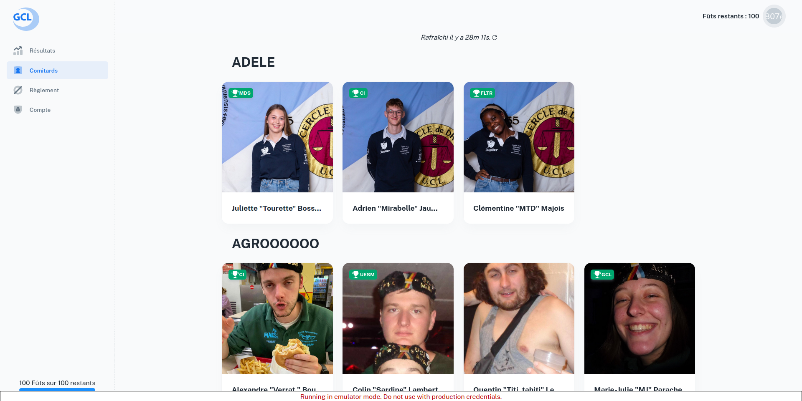

## MercatosGCL

> Website for the GCL mercatos

## Link
- [Public link](https://mercatosgcl.web.app/)

## Quick start

- **Clone** `git clone https://github.com/riri-314/mercatosGCL.git`
- Need to use `Node.js v20.x`!!!!
- **Install:** `npm install`
- **Start:** `npm run dev`
- **Build:** `npm build`

## Emulator
First change debug to true in firebase_config.ts

### Importing firestore data to local storage: 

gsutil -m cp -r gs://bucket_export_test/2025-02-10T17\:25\:33_46845 ~/git/mercatosGCL

source: https://stackoverflow.com/questions/57838764/how-to-import-data-from-cloud-firestore-to-the-local-emulator

### Start the emulator
firebase emulators:start --import ./2025-02-10T17:25:33_46845 --export-on-exit

Todo Henri:
modifier supprimer encheres, tout à faire
optimiser page résultats, trop lente
changer adresse mail d'un président //caca mais faisable en backend admin

Todo Flo:
modifier supprimer encheres, tout à faire
changer create comitard pour avoir petite photo